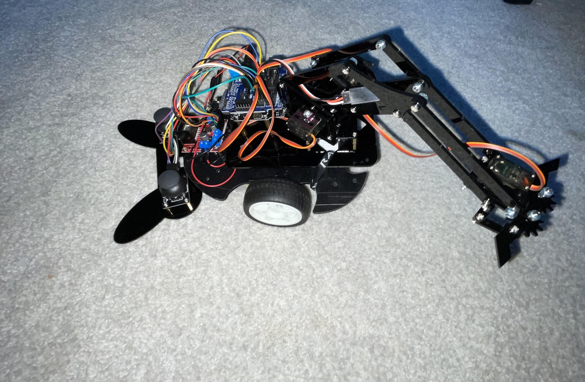

# Robotic arm Rover
This is my project of a Robotic arm which I attached onto a previous project. I modified the code to make the wheels move with the press of the joystick button. My biggest challenge was how I had to learn the arduino code by myself, and coding in the arduino code. But this was also one of the things I enjoyed learning most.

| **Engineer** | **School** | **Area of Interest** | **Grade** |
|:--:|:--:|:--:|:--:|
| Atlas M | Head-Royce School (HRS) | Mechanical Engineering | Incoming Freshman



# Final Milestone

**Don't forget to replace the text below with the embedding for your milestone video. Go to Youtube, click Share -> Embed, and copy and paste the code to replace what's below.**

For your final milestone, explain the outcome of your project. Key details to include are:
- What you've accomplished since your previous milestone
- What your biggest challenges and triumphs were at BSE
- A summary of key topics you learned about
- What you hope to learn in the future after everything you've learned at BSE


# Second Milestone

**My second Milestone was successfully attaching the wheels to my arm along with getting the app working on the phone. I also completed wiring, and coding the robot so I can now controll the wheels and the arm through the PS2 controller. I can now connect with the HC-06 through the android phone and send inputs through the phone, which will move the arm accordingly. I also attached the current arm onto a previous rover that I worked on which had wheels. One surprising thing about the project, was how well the base for the arm fit in with the base for the rover. Some of the challenges I faced include that the main arm only had one corresponding screw hole to screw into the rover, meaning that it would move around. I overcame this challenge by taking 2 shoelaces and tying them around the front to create stability. Another challenge that I faced was that the arm was too high to grab things down below, I fixed this by swapping the standoffs between the arduino, and the arm. This rose another challenge though, as the arduino got in the way, as the arm was rotating. I also solved this by using a pocket knife to carve into the frame of the arm and allow it to rotate through the arduino itself. Another challenge I faced was that the right wheel was not working properly. I easily fixed this, by adjusting my code, and choosing different ports in the sensor sheild, since ports 0 and 1 were not working. Before my final Milestone, I plan on making the controller remote. Since the controller is attached to the arduino board with wiring. I plan on doing this by using a PS2 wireless adapter onto the arduino.**

<iframe allowfullscreen width='852' height='480' scrolling='no' frameborder='0' style='border: none;' src='https://www.wevideo.com/embed/#3130678975' allowfullscreen></iframe>


# First Milestone

**My first milestone was getting my arm built and functioning along with the PS2 controller attached to it. After I got all 4 servos working, I went on to finish the arm itself. A servo works similarly to a motor, but it can only move a certain degree. Meaning that servos work perfectly for things like steering a RC car, or a robotic arm. The arm moves by taking the X and Y inputs of each joystick from the PS2 controler. The signals are then sent to the arduino to move the servos corespondingly. One major challenge that I faced was getting the angle right for the each servo on the arm. Since each servo is set at 90 degrees by default, I need to put on the parts at the right angle for the arm to have full range of motion. For example, if the servo is set at 60 degrees, the actual arm part that goes on the servo needs to be at the same degree as the servo. Otherwise, the joint in the arm will not function properly. The next step for me is to get the app working on the phone, and to add wheels, and a battery pack to the arm.**

<iframe allowfullscreen width='852' height='480' scrolling='no' frameborder='0' style='border: none;' src='https://www.wevideo.com/embed/#3128006909' allowfullscreen></iframe>


# Code

**Starter code to get the arm moving with the PS2 controller input**

```c++
#include <Servo.h>
Servo myservo1;  // create servo object to control a servo
Servo myservo2;
Servo myservo3;
Servo myservo4;
int pos1=90, pos2=90, pos3=90, pos4=90; 

void setup()
{
  myservo1.attach(3);    // set the control pin of servo 1 to 3 digital I/0
  myservo2.attach(5);    // set the control pin of servo 1 to 3 digital I/0
  myservo3.attach(6);    // set the control pin of servo 1 to 3 digital I/0
  myservo4.attach(9);    // set the control pin of servo 1 to 3 digital I/0
  
  myservo1.write(pos1);
  myservo2.write(pos2);
  myservo3.write(pos3);
  myservo4.write(pos4);
  delay(1500);
}

void loop() 
{

  // close the claw 
  for(pos4;pos4>45;pos4--)
  {
    myservo4.write(pos4);
  }
  delay(1000);
  
 // open the claw
 for(pos4;pos4<120;pos4++)
 {
   myservo4.write(pos4);
 }
  delay(1000);

// turn right
  for(pos1;pos1>30;pos1--)
  {
    myservo1.write(pos1);
    delay(5);      // delay 5ms（used to adjust the servo speed）
  }
  delay(1000);

   // turn to left 
  for(pos1;pos1<150;pos1++)
  {
    myservo1.write(pos1);
    delay(5);
  }
  delay(1000);

  //  stretch out the arm
  for(pos2;pos2<130;pos2++)
  {
    myservo2.write(pos2);
    delay(5);
  }
  delay(1000);\

  // retracte the arm
  for(pos2;pos2>80;pos2--)
  {
    myservo2.write(pos2);
    delay(5);
  }
  delay(1000);

  // raise the arm 
  for(pos3;pos3<100;pos3++)
  {
    myservo3.write(pos3);
    delay(5);
  }
  delay(1500);

 // Lower the arm 
  for(pos3;pos3>40;pos3--)
  {
    myservo3.write(pos3);
    delay(5);
  }
  delay(1000);

}
```

**Things I added to the previous code to add in the wheels**

```c++
const int in1 = 12; // define the in1 pin from the motor driver
const int in2 = 13; // define the in2 pin from the motor driver
const int in3 = 10; // define the in3 pin from the motor driver
const int in4 = 11; // define the in4 pin from the motor driver
const int enA = 2;
const int enB = 4;

void setup()
{
pinMode(right_key, INPUT_PULLUP); // set the right/left key to INPUT_PULLUP
pinMode(left_key, INPUT_PULLUP);
pinMode(in1, OUTPUT); // set all Input keys in the motor driver to OUTPUT
pinMode(in2, OUTPUT);
pinMode(in3, OUTPUT);
pinMode(in4, OUTPUT);
pinMode(enA, OUTPUT);
pinMode(enB, OUTPUT);
Serial.begin(9600); // set the baud rate to 9600
}
void loop()
{
//right wheel forward
if (z2==0) // if right joystick pushed down
{
right_wheel();
}
else
{
stop_right();
}

//left wheel forward
if (z1==0) // if left joystick pushed down
{
left_wheel();
}
else
{
stop_left();
}

}
//right wheel forward
void right_wheel()
{
digitalWrite(in1, HIGH);
digitalWrite(in2, LOW);
analogWrite(enA, 200);
}

//left wheel forward
void left_wheel()
{
digitalWrite(in3, HIGH);
digitalWrite(in4, LOW);
analogWrite(enB, 200);
}

//stop the right wheel from turning
void stop_right()
{
digitalWrite(in1, LOW);
digitalWrite(in2, LOW);
}

//stop the left wheel from turning
void stop_left()
{
digitalWrite(in3, LOW);
digitalWrite(in4, LOW);
}
```


# Bill of Materials

**NOTE: The materials listed are only the electronic parts and do NOT include the base. If you want to make this project for yourself, you might have to build your own structure for the arm/rover**

| **Part** | **Note** | **Price** | **Link** |
|:--:|:--:|:--:|:--:|
| Servos 4x | Used for arm itself | $9.99 | <a href="https://www.amazon.com/Micro-Servos-Helicopter-Airplane-Controls/dp/B07MLR1498/ref=asc_df_B07MLR1498/?tag=hyprod-20&linkCode=df0&hvadid=330396616558&hvpos=&hvnetw=g&hvrand=13137842343917798051&hvpone=&hvptwo=&hvqmt=&hvdev=c&hvdvcmdl=&hvlocint=&hvlocphy=9032027&hvtargid=pla-670000123095&psc=1&tag=&ref=&adgrpid=66216311757&hvpone=&hvptwo=&hvadid=330396616558&hvpos=&hvnetw=g&hvrand=13137842343917798051&hvqmt=&hvdev=c&hvdvcmdl=&hvlocint=&hvlocphy=9032027&hvtargid=pla-670000123095"> Link </a> |
| Arduino uno 2x | Used for arm and controller | $28.50 | <a href="https://www.amazon.com/Arduino-A000066-ARDUINO-UNO-R3/dp/B008GRTSV6/ref=sr_1_1_sspa?crid=19UAOWDV80VTV&keywords=arduino+uno&qid=1689882651&s=toys-and-games&sprefix=arduino+uno%2Ctoys-and-games%2C152&sr=1-1-spons&sp_csd=d2lkZ2V0TmFtZT1zcF9hdGY&psc=1"> Link </a> |
| Sheild sensor v5.0 2x | Used for arm and controller | $19.99 | <a href="https://www.amazon.com/Arduino-A000066-ARDUINO-UNO-R3/dp/B008GRTSV6/ref=sr_1_1_sspa?crid=19UAOWDV80VTV&keywords=arduino+uno&qid=1689882651&s=toys-and-games&sprefix=arduino+uno%2Ctoys-and-games%2C152&sr=1-1-spons&sp_csd=d2lkZ2V0TmFtZT1zcF9hdGY&psc=1](https://www.amazon.com/RedTagCanada-Expansion-Duemilanove-Electronic-Building/dp/B09JVV4K1Y/ref=sr_1_2?keywords=shield+sensor+v5.0&qid=1689882719&sr=8-2)https://www.amazon.com/RedTagCanada-Expansion-Duemilanove-Electronic-Building/dp/B09JVV4K1Y/ref=sr_1_2?keywords=shield+sensor+v5.0&qid=1689882719&sr=8-2"> Link </a> |
| DC motors 2x | Used for wheels | $6.99 | <a href="https://www.amazon.com/BOJACK-Pcs-Type-130-EK1450/dp/B09FPXF1QK/ref=sr_1_1_sspa?crid=1SDZY0Q2A2T3S&keywords=DC+motors+for+arduino&qid=1689882823&sprefix=dc+motors+for+arduino%2Caps%2C160&sr=8-1-spons&sp_csd=d2lkZ2V0TmFtZT1zcF9hdGY&psc=1"> Link </a> |
| L298N motor driver 1x | Used for wheels | $11.49 | <a href="https://www.amazon.com/HiLetgo-Controller-Stepper-H-Bridge-Mega2560/dp/B07BK1QL5T/ref=sr_1_1_sspa?crid=3GIUAX07XRITO&keywords=L298N+motor+driver&qid=1689882914&sprefix=l298n+motor+driver%2Caps%2C146&sr=8-1-spons&sp_csd=d2lkZ2V0TmFtZT1zcF9hdGY&psc=1"> Link </a> |
| PS2 joystick module 2x | Used for controller | $6.29 | <a href="https://www.amazon.com/HiLetgo-Controller-JoyStick-Breakout-Arduino/dp/B00P7QBGD2/ref=sr_1_1_sspa?crid=3BKAOICBCQ05L&keywords=PS2+joystick+module+for+arduino&qid=1689882973&sprefix=ps2+joystick+module+for+arduino%2Caps%2C145&sr=8-1-spons&sp_csd=d2lkZ2V0TmFtZT1zcF9hdGY&psc=1"> Link </a> |
| HC05 bluetooth module | Used for controller and car | $9.99 | <a href="https://www.amazon.com/DSD-TECH-HC-05-Pass-through-Communication/dp/B01G9KSAF6/ref=sr_1_1_sspa?crid=2O2MA0I6RM9TI&keywords=HC05&qid=1689883037&sprefix=hc05%2Caps%2C144&sr=8-1-spons&sp_csd=d2lkZ2V0TmFtZT1zcF9hdGY&psc=1"> Link </a> |
| Dupont wires | Used for everything | $8.99 | <a href="https://www.amazon.com/EDGELEC-Breadboard-1pin-1pin-Connector-Multicolored/dp/B07GD1D64V/ref=sr_1_5?crid=32Q0LA6DCQI0J&keywords=m%2Ff+wire+connectors+for+arduino&qid=1689883109&sprefix=m%2Ff+wire+connectors+for+arduino%2Caps%2C140&sr=8-5"> Link </a> |


# Scematics 

**Wiring diagram of motor driver to arduino shield**
.png)
